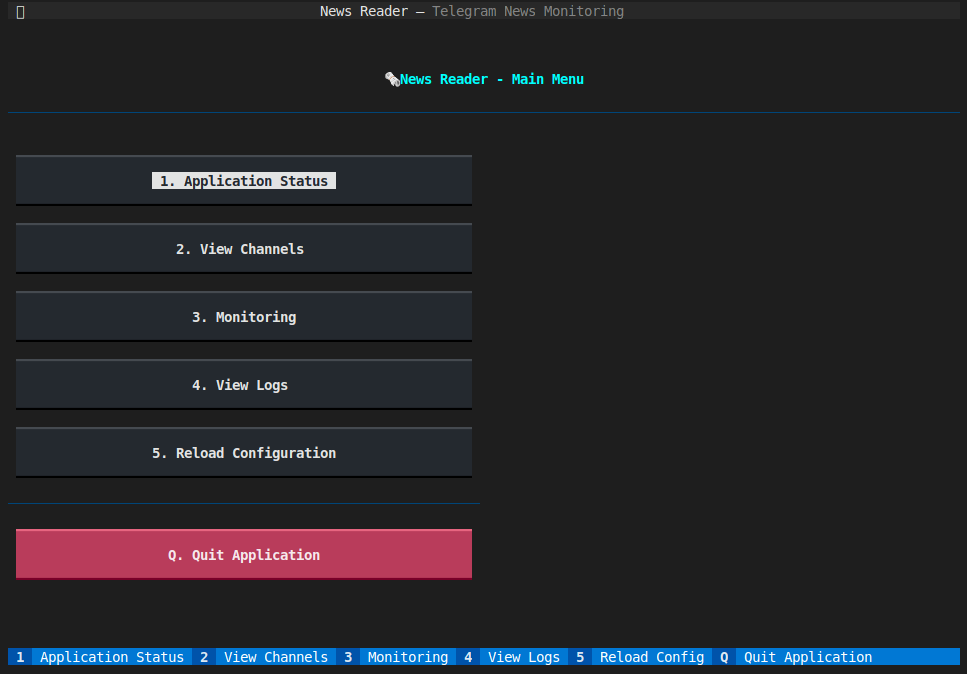

# News Reader

A specialized Telegram client that reads your newsfeed and uses an LLM to provide a daily summary.




## Features

- 🚀 **Unified Application**: Single app with multiple async tasks for monitoring and CLI interaction
- 🔐 **Secure Session Management**: In-memory session storage only (no disk storage) with user login at startup
- 💬 **Interactive CLI**: Real-time command interface while monitoring channels
- 📡 **Real-time Monitoring**: Continuous monitoring of configured Telegram channels
- 📱 **Telegram Connection**: Secure connection and authorization to Telegram
- 🐳 **Docker Support**: Containerized deployment with Docker Compose
- 📺 **Channel Management**: List and select specific channels for monitoring
- 🗄️ **Local Database**: pysonDB-based local JSON database for storing configuration
- 🎨 **Colored Output**: Beautiful colored terminal output
- ⚡ **Async Architecture**: Efficient async/await based architecture

## Prerequisites

- **For Docker setup**: Docker and Docker Compose
- **For Virtual Environment setup**: Python 3.7+ and virtualenvwrapper
- Telegram API credentials (API ID and API Hash)
- Phone number registered with Telegram

## Quick Start

### 1. Get Telegram API Credentials

1. Go to [https://my.telegram.org/apps](https://my.telegram.org/apps)
2. Log in with your phone number
3. Create a new application
4. Note down your `API ID` and `API Hash`

### 2. Setup

The setup script now supports both Docker and Python virtual environment:

```bash
# Clone or download the project
cd news_reader

# Run the interactive setup script
./setup.sh

# Choose your preferred setup method:
# 1) Docker (recommended for production)
# 2) Python Virtual Environment (recommended for development)

# Edit the .env file with your credentials
nano .env
```

#### Option 1: Docker Setup
- Automatically builds Docker containers
- Isolated environment
- Easy deployment and scaling
- No local Python dependencies needed

#### Option 2: Virtual Environment Setup
- Uses `mkvirtualenv` to create isolated Python environment
- Direct Python execution (faster for development)
- Better for debugging and development
- Requires Python 3.7+ and virtualenvwrapper

**Installing virtualenvwrapper (if not already installed):**
```bash
# Install virtualenvwrapper
pip3 install virtualenvwrapper

# Add to your ~/.bashrc or ~/.zshrc
echo 'export WORKON_HOME=$HOME/.virtualenvs' >> ~/.bashrc
echo 'export PROJECT_HOME=$HOME/Devel' >> ~/.bashrc
echo 'source /usr/local/bin/virtualenvwrapper.sh' >> ~/.bashrc

# Reload your shell configuration
source ~/.bashrc
```

### 3. Configure Environment

Edit the `.env` file with your credentials:

```env
# Telegram API credentials
API_ID=your_api_id_here
API_HASH=your_api_hash_here
PHONE_NUMBER=+1234567890

# MTProto server configuration (default values work for most cases)
MTPROTO_SERVER_IP=149.154.167.50
MTPROTO_SERVER_PORT=443
MTPROTO_PUBLIC_KEY=-----BEGIN RSA PUBLIC KEY-----
MIIBCgKCAQEAwVACPi9w23mF/S2lqbz7xWWdvuYcuqnBDqpAJGI2PSPSfIFsmplW
RTD/33CWgQe6OaVldqOdGpWpn3EQ3ym3hAXfRZNEr/+BqQXn+F8jmTfFrQGx8+9J
8S4tEqYlNYIlnHtqMNoFk1NHpJ/hpQXn+F8jmTfFrQGx8+9J8S4tEqYlNYIlnHtq
MNoFk1NHpJ/hpQXn+F8jmTfFrQGx8+9J8S4tEqYlNYIlnHtqMNoFk1NHpJ/hpQXn
+F8jmTfFrQGx8+9J8S4tEqYlNYIlnHtqMNoFk1NHpJ/hpQXn+F8jmTfFrQGx8+9J
8S4tEqYlNYIlnHtqMNoFk1NHpJ/hpQXn+F8jmTfFrQGx8+9J8S4tEqYlNYIlnHtq
QIDAQAB
-----END RSA PUBLIC KEY-----

# Note: Session is stored in memory only for security (no SESSION_NAME needed)
```

### 3. Running the Application

The refactored News Reader is now a unified application that handles both monitoring and CLI interaction in a single process.

#### For Docker Setup:
```bash
# Start the unified News Reader application
docker-compose up news-reader

# Or run interactively
docker-compose run --rm news-reader
```

#### For Virtual Environment Setup:
```bash
# Start the application (will create/activate venv automatically)
./run_venv.sh

# Or manually activate and run
workon news-reader
python news_reader/main.py
```

The application will:
1. Prompt for authorization on first run (phone number, verification code, 2FA if enabled)
2. Load your session data into memory
3. Start monitoring configured channels in the background
4. Provide an interactive CLI for commands

## Usage

### Interactive Commands

Once the application is running, you can use the following commands in the interactive CLI:

```
help           - Show available commands
status         - Show application status (user info, connection status, etc.)
channels       - List all your channels (shows which ones are monitored)
monitor        - Show current monitoring status
monitor setup  - Setup/change channel monitoring configuration
reload         - Reload configuration from database
quit/exit      - Exit the application
```

### Example Session

```bash
# Start the application
./run_venv.sh

# The app will start and show:
🚀 Starting News Reader Application...
🔐 Authorization required...
📱 Code sent to +1234567890
Enter the code you received: 12345
✅ Successfully authorized!
✅ Application started successfully!
📱 User: John Doe
📺 Monitoring 3 channels
📡 Monitoring started for 3 channels
💬 Interactive CLI started. Type 'help' for available commands.

# Now you can use interactive commands:
> help
📚 Available Commands:
  help           - Show this help message
  status         - Show application status
  channels       - List all your channels
  monitor        - Show monitoring status
  monitor setup  - Setup channel monitoring
  reload         - Reload configuration
  quit/exit      - Exit the application

> channels
📡 Fetching your channels...
📺 Your channels:
ID              Title
------------------------------------------------------------
✅ -1001234567890 Tech News Channel
✅ -1001234567891 Crypto Updates
   -1001234567892 General Chat

> monitor setup
🔧 Select channels to monitor:
Enter channel IDs separated by commas (or 'all' for all channels):
> -1001234567890,-1001234567891
✅ Selected 2 channels:
  - Tech News Channel
  - Crypto Updates
💾 Saved monitoring configuration

# Meanwhile, new messages appear in real-time:
📨 [2025-10-12 15:30:45] New message
👤 From: NewsBot
💬 Chat: Tech News Channel (-1001234567890)
📝 Message: Breaking: New AI breakthrough announced...
```

### Real-time Monitoring

The unified application automatically starts monitoring configured channels in the background. Messages from monitored channels will appear in real-time while you use the interactive CLI.

**Database Storage:** Channel configurations are stored in the `data/` directory using pysonDB. This directory is automatically created and the database files are stored locally for easy backup.

**Key Features:**
- ✅ **Simultaneous Operation**: Monitor channels while using CLI commands
- 📱 **Real-time Updates**: New messages appear immediately
- 🎯 **Filtered Monitoring**: Only shows messages from your selected channels
- 💾 **Persistent Configuration**: Channel settings saved to local database
- 🔄 **Dynamic Reconfiguration**: Change monitored channels without restarting

### Docker Usage

```bash
# Start the application with Docker
docker-compose up news-reader

# Or run interactively
docker-compose run --rm news-reader

# View logs
docker-compose logs -f news-reader
```

## Project Structure

```
news_reader/
├── news_reader/          # Main Python package
│   ├── __init__.py       # Package initialization
│   ├── app.py            # Main application controller
│   ├── main.py           # Main entry point
│   ├── monitoring_task.py # Telegram message monitoring task
│   ├── cli_task.py       # Interactive CLI task
│   ├── config.py         # Configuration management
│   └── db_client.py      # Database client
├── data/                 # Data directory (database storage)
├── logs/                 # Log files directory
├── requirements.txt      # Python dependencies
├── Dockerfile           # Docker container definition
├── docker-compose.yml   # Docker Compose configuration
├── setup.sh             # Interactive setup script (Docker + virtualenv)
├── run_venv.sh          # Helper script for virtual environment
├── .env.example         # Environment variables template
└── README.md            # This file
```

### Architecture Changes

The refactored application features modular design with separate classes:

- **`app.py`**: Main application controller
  - Telegram client initialization and authentication
  - Session management in memory
  - Task coordination and lifecycle management
  - Graceful shutdown handling

- **`monitoring_task.py`**: Telegram message monitoring
  - Event handlers for new/edited messages
  - Channel filtering and message display
  - Background monitoring loop

- **`cli_task.py`**: Interactive command-line interface
  - Command processing and user interaction
  - Channel management and configuration
  - Status reporting and help system

- **`main.py`**: Simple entry point launcher

## Configuration

### MTProto Server Settings

The client supports custom MTProto server configuration:

- `MTPROTO_SERVER_IP`: IP address of the MTProto server
- `MTPROTO_SERVER_PORT`: Port of the MTProto server
- `MTPROTO_PUBLIC_KEY`: Public key for the MTProto server

Default values are configured for Telegram's official servers, but you can modify them for custom implementations.

### Session Management

Sessions are stored in the `sessions/` directory and mounted as a Docker volume. This ensures your authorization persists between container restarts.

## Docker Commands

```bash
# Build the image
docker-compose build

# Connect and authorize
docker-compose run --rm news-reader connect

# Start monitoring service
docker-compose up news-reader-monitor

# Stop all services
docker-compose down

# View logs
docker-compose logs news-reader
docker-compose logs news-reader-monitor

# Clean up
docker-compose down -v
docker system prune
```

## Troubleshooting

### Common Issues

1. **Authorization Required**
   ```bash
   # Re-run the connect command
   docker-compose run --rm news-reader connect
   ```

2. **Session File Issues**
   ```bash
   # Clear sessions and re-authorize
   rm -rf sessions/*
   docker-compose run --rm news-reader connect
   ```

3. **API Credentials Invalid**
   - Double-check your API ID and API Hash in the `.env` file
   - Ensure there are no extra spaces or quotes

4. **Phone Number Format**
   - Use international format: `+1234567890`
   - Include the country code

### Debug Mode

Enable debug logging by modifying the `docker-compose.yml`:

```yaml
environment:
  - PYTHONPATH=/app
  - PYTHONUNBUFFERED=1
  - TELETHON_LOG_LEVEL=DEBUG
```

## Security Notes

- Never commit your `.env` file to version control
- **Sessions are stored in memory only** - no sensitive data written to disk
- Use strong 2FA passwords
- Consider using a dedicated API application for this client
- Application requires re-authentication on each restart (security feature)

## Contributing

1. Fork the repository
2. Create a feature branch
3. Make your changes
4. Test with Docker Compose
5. Submit a pull request

## License

This project is provided as-is for educational and personal use.

## Support

For issues and questions:
1. Check the troubleshooting section
2. Review Docker Compose logs
3. Ensure all prerequisites are met
4. Verify your Telegram API credentials
